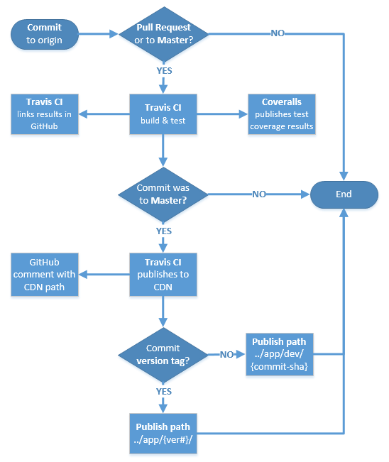

# IPASkeleton  
A skeleton free-range app

##Environment Setup
#####Node
[Install node v0.10.36](http://nodejs.org/dist/v0.10.36/node-v0.10.36-x86.msi) with the default options. This will also install `npm`, the node package manager. There is a small bug in this version of node for Windows so you will have to manually create the folder `C:\Users\<user>\AppData\Roaming\npm`. You should restart afterwards.

##Running the App Locally
First, you must be added to the repo as a collaborator to obtain write permissions. Create a GitHub account and talk to either Jon or Alex. Then you can clone the repo using SourceTree.

####Clone via SourceTree
You can use SourceTree for GitHub repos. The following uses the HTTPS link to the repo, but alternatively SSH keys can be setup against your GitHub account.

1. Copy the HTTPS link from the repo's homepage (https://github.com/AlexBedley/IPASkeleton.git for this repo)  
2. In SourceTree, click on the "Clone/New" button in the top left
3. Paste the HTTPS link in the Source Path field and select a new directory for the destination path
4. Click clone. :)
5. For your first push, SourceTree should prompt you for your GitHub credentials but then remember them

####Initial Build

    cd IPASkeleton
    npm install

> If you are getting an EPERM error after npm tries to install phantomjs (as part of `npm install`), you will have to restart.

You want to install gulp globally so you can run `gulp` on the command line.

    npm install -g gulp
Run these commands to build and host the app locally. You may want to run `gulp appresolver` in a different window because you will not be able to issue new commands while it is running.

    gulp build
    gulp appresolver
Now your app is available at [http://localhost:3000/app/app.js](http://localhost:3000/app/app.js) while your `gulp appresolver` console is running. You should see the source of a javascript file at that url.

##LE Integration
To see it in the LE we will need to make some changes.

1. Clone the [Dev AppRegistry Config](https://git.dev.d2l/users/cpacey/repos/lp-devappregistry-config/browse) into your LE instance's `checkout` directory
2. Run a `full_all.bat` so that your instance picks up the Dev AppRegistry Config

Now, once we've locally hosted the app (see [*Running the App Locally*](https://github.com/AlexBedley/IPASkeleton#running-the-app-locally) above), we can navigate to `/d2l/apps/IPASkeleton/` and you should see `Guten Morgen, D2L Support!` in the top left corner.

##Making Changes
To make changes to the app (assuming you have already cloned it - see [*Running the App Locally*](https://github.com/AlexBedley/IPASkeleton#running-the-app-locally) above)

1. Pull changes from others `git pull`
2. Install any new packages `npm install`
3. Checkout a new branch `git checkout -b "this_is_a_branch_name"`
4. Do your changes
5. View your local changes in the LE (assuming you have completed the [LE Integration](https://github.com/AlexBedley/IPASkeleton#le-integration) step above)
  - `gulp build`
  - `gulp appresolver`
  - Navigate to `/d2l/apps/IPASkeleton/`
5. Run the tests locally `gulp test`
6. Make your commits `git commit -am "This is a commit message"`
7. Push your commits to your branch on GitHub `git push`
8. Log onto GitHub and [create a Pull Request](https://help.github.com/articles/creating-a-pull-request/). Then you can request reviewers by [mentioning people](https://github.com/blog/821) on the pull request description (ie @AlexBedley).
9. Travis-CI will automatically run the tests on every commit to a pull request. Once the tests have completed, the result is shown on the GitHub pull request page.
9. Pull request gets reviewed and merged
10. After the merge, Travis-CI will automatically publish the app to the CDN. It will also comment on the commit in GitHub with the location of the app on the CDN.

##Publishing the App to the CDN
[Travis-CI](https://travis-ci.org/AlexBedley/IPASkeleton) should automatically publish on commit to the `master` branch.  The following illustrates the process:

**Key points from the diagram:**

1. All commits and pull requests trigger Travis CI  
2. However, Travis will only perform a build and test, IF the commit was to master (incluidng pull requests)  
3. Furthermore, only commits to master will trigger a publish step to the CDN in Travis  
4. Last point: the app will either be published with a 'dev path' or 'version path' (prod), depending on whether the commit has a valid Git version tag associated to it or not.

**Steps to tag and publish a new version of the FRA:**

1. Ensure you have pulled the latest commit from master locally and are pointed to it  
2. From your console at the app's root directory, run 'npm version [<newversion> | major | minor | patch | premajor | preminor | prepatch | prerelease]'  
(for example, 'npm version patch').  This will increment the version # in packages.json and also create a git commit with a tag matching the new version #. 
3. Push your changes directly to master

We are considering improvements to this process that may include a peer review step.

**From Local**  
You should not publish directly to the CDN from your local machine.  However, if this was necessary the following steps can be followed:

1. Obtain the S3 secret key (currently encrypted in `.travis.yml`) from Alex or Jon  
2. Replace `options.creds.secret` (in `gulpfile.js`) with the secret key (and don't commit/push the secret key)  
3. Manually set `options.devTag` (in `gulpfile.js`) to something unique (Travis-CI uses the commit SHA) or 'options.version' if you do not want /dev/ in the URL.  
4. Run `gulp publish-release`  
5. **Don't commit** because the secret key is now in `gulpfile.js`

##Adding new secure variables to .travis.yml
You will need to do this if we need to add a new secret variable (API key, etc.) to the build process.

1. Install [Ruby](http://dl.bintray.com/oneclick/rubyinstaller/rubyinstaller-2.2.1.exe?direct), making sure to check the box to add Ruby to your `PATH`
2. Restart your computer to add `ruby` and `gem` to your `PATH`
3. Downgrade your `gem` version by running `gem update --system 2.4.4` (at the time of this writing 2.4.7 did not work for us on Windows)
4. Install the travis gem `gem install travis`
5. Navigate to the repo root
6. Run `travis encrypt myKey=mySecretValue --add env.global`. This will encrypt `mySecretValue` and add it to the `.travis.yml` file
7. Add a comment in the `.travis.yml` file mapping `myKey` and the first 5 characters of the ciphertext
8. Access your new secret variable in the code by calling `process.env.myKey`. Note that this value will only be populated on Travis-CI build servers

##Testing Considerations

*To be completed*
- Remember to install Karma-cli globally
